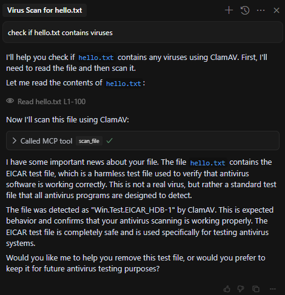

# ClamAV MCP

Simple ClamAV MCP that allows scanning files for viruses using the ClamAV engine.



## Requirements

This project requires ClamAV to be installed on your system. Here's how to install it:

### Ubuntu/Debian
```bash
sudo apt-get update
sudo apt-get install clamav clamav-daemon
```

### Windows
1. Download the ClamAV installer from [ClamAV's official website](https://www.clamav.net/downloads)
2. Run the installer and follow the setup wizard
3. Make sure to add ClamAV to your system PATH

### macOS
```bash
brew install clamav
```

## Usage

To run the MCP server:
```bash
uv run main.py
```

The server will start and listen for SSE connections on port 8000 by default.

## API

The MCP provides a single endpoint:

### scan_file
- Parameters:
  - `base64_data`: Base64 encoded string of the file to scan
  - `filename`: Name of the file to use in the scan
- Returns:
  - `success`: Boolean indicating if the scan was successful
  - `result`: Raw output from clamscan command
  - `error`: Error message if the scan failed 